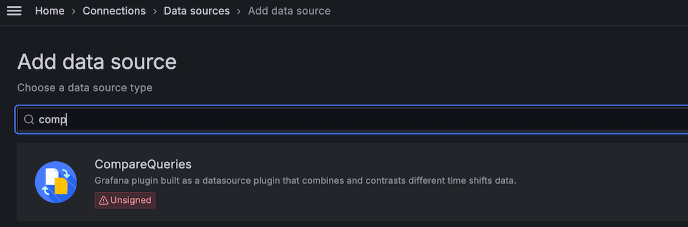
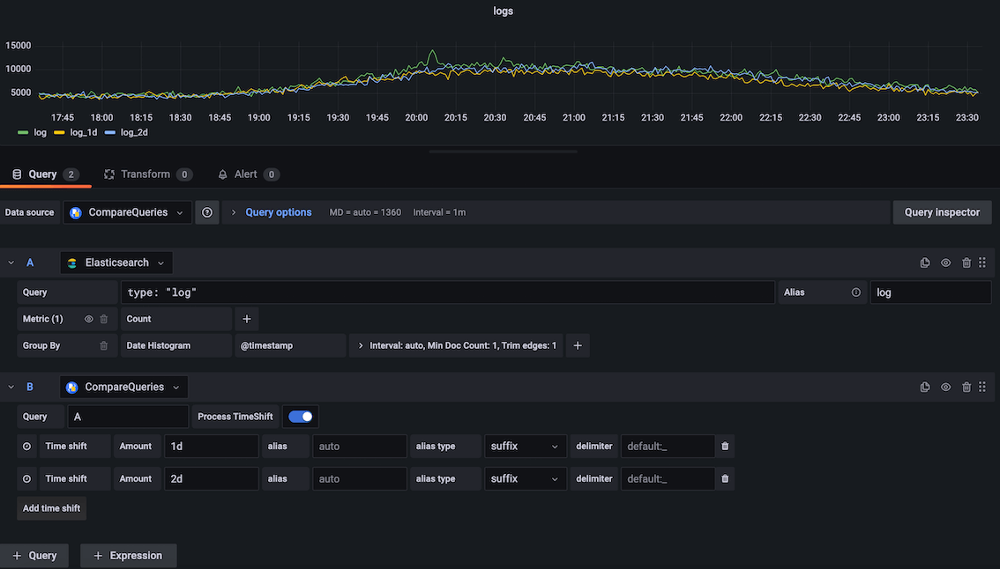

[](https://github.com/leoswing/comparequeries-datasource-rc/actions/workflows/pr-codeql-analysis-typescript.yml) 

# Overview

This data source plugin enables data comparison capabilities by supporting queries from multiple data sources. It allows you to use custom time shifts to display data from different time ranges within a single graph.

[](LICENSE)


Key features:

- Compatible with Grafana 11
- Resolves issues with undefined data points
- Introduces support for timeShift aliases
- Cache datasource query result and reduce query reduction when query condtions remains the same.


# Installation

For detailed instructions on how to install the plugin on Grafana Cloud or locally, please checkout the [Plugin installation docs](https://grafana.com/docs/grafana/latest/administration/plugin-management/).


# Quick start

Step 1. Create a data source with your type based on your demand, such as Elasticsearch.

Step 2. Create a data source with type CompareQueries. Grafana --> Connections --> Data sources --> Add new data source， then type 'compare' to use CompareQueries plugin.


Step 3. Create a basic query using your database, such as Elasticsearch.

Step 4. Create a comparison query based on the basic query. To create multi-line time series, the query requires at least 2 fields in the following order:

- field `Query`: `Query` field which refer to the basic query name
- field `Amount`: `Amount` field with time range value, time shift supports：s(second), m(minute), h(hour), d(day), w(week), M(month), y(year)


# Breaking changes

- This plugin has refactor the plugin id with `leoswing-comparequeries-datasource`.

# Install

## Install with Grafana CLI

If you install the plugin using the Grafana CLI, then you can follow the tuturial as below.

### 1. Plugin download

Download the zip file into a temp folder from github release page, like commands as below:

```bash
wget -c https://github.com/leoswing/comparequeries-datasource-rc/releases/download/2.0.0/leoswing-comparequeries-datasource-2.0.0.zip
```

### 2. Install plugin with grafana-cli

Install this plugin into Grafana plugins directory (default is `/var/lib/grafana/plugins` if you installed grafana using a package). 

```bash
sudo grafana-cli --pluginUrl leoswing-comparequeries-datasource-2.0.0.zip plugins install leoswing-comparequeries-datasource
```

### 3. Restart Grafana server

You need to restart grafana server when previous steps are done. And then Restart grafana.

```bash
sudo service grafana-server restart
```

## Install with docker image

If you install the plugin inside the docker image, then you can follow the document as below.

### Custom Dockerfile

Custom Dockerfile contents as follows:

```ini
# Using your node image version, eg. Node 14
FROM node:14-alpine AS build-stage
WORKDIR /plugins
COPY ./plugins/leoswing-comparequeries-datasource-2.0.0.zip leoswing-comparequeries-datasource-2.0.0.zip

RUN \
  unzip leoswing-comparequeries-datasource-2.0.0.zip && \
  rm -rf leoswing-comparequeries-datasource-2.0.0.zip

# Using your base grafana version
FROM grafana/grafana:10.4.2

# Disable Login form or not
ENV GF_AUTH_DISABLE_LOGIN_FORM "false"
# Allow anonymous authentication or not
ENV GF_AUTH_ANONYMOUS_ENABLED "false"
# Role of anonymous user
ENV GF_AUTH_ANONYMOUS_ORG_ROLE "Admin"
# Install plugins here our in your own config file
# ENV GF_INSTALL_PLUGINS="<list of plugins seperated by ,"

# Add configuration file
ADD ./grafana.ini /etc/grafana/grafana.ini

RUN chmod -R 755 /var/lib/grafana/plugins/

COPY --from=build-stage /plugins/ /var/lib/grafana/plugins/leoswing-comparequeries-datasource
```

## Grafana container config

Installing CompareQueries Grafana datasource [requires](https://grafana.com/docs/grafana/latest/setup-grafana/configure-grafana/#allow_loading_unsigned_plugins)
the following secion changes to Grafana's `grafana.ini` config:

``` ini
[plugins]
allow_loading_unsigned_plugins = leoswing-comparequeries-datasource
```

For `grafana-operator` users, please adjust `config:` section in your `kind=Grafana` resource as below

```
  config:
    plugins:
      allow_loading_unsigned_plugins: "leoswing-comparequeries-datasource"
```

## Datasource plugin usage

Step 1. Create a data source of your type based on your demand, such as Elasticsearch.

Step 2. Create a data source of type CompareQueries. Grafana --> Connections --> Data sources --> Add new data source， then type 'compare' to use CompareQueries plugin



Step 3. Create a basic query using your database, such as Elasticsearch.

Step 4. Create a comparison query based on the base query.
Step 5. Increase the time of comparison query in comparison query, Time shift supports：s(second), m(minute), h(hour), d(day), w(week), M(month), y(year)




# Contributing

If you're interested in contributing to the project:

- Start by reading the [Contributing guide](./CONTRIBUTING.md).
- Learn how to set up your local environment, in our [Developer guide](./developer-guide.md).


# License

This plugin is distributed under Apache-2.0 License..
