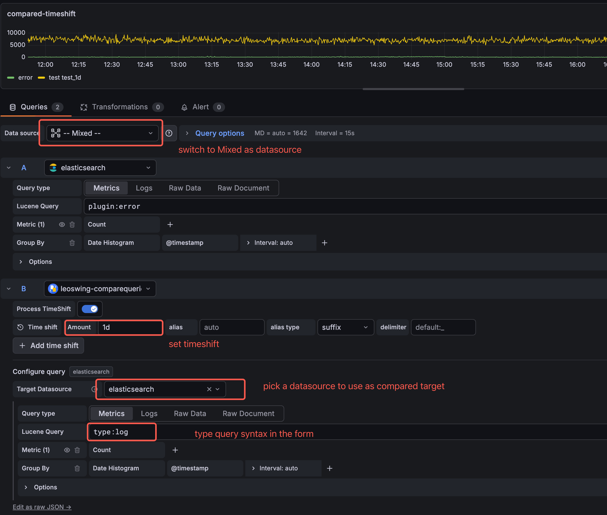
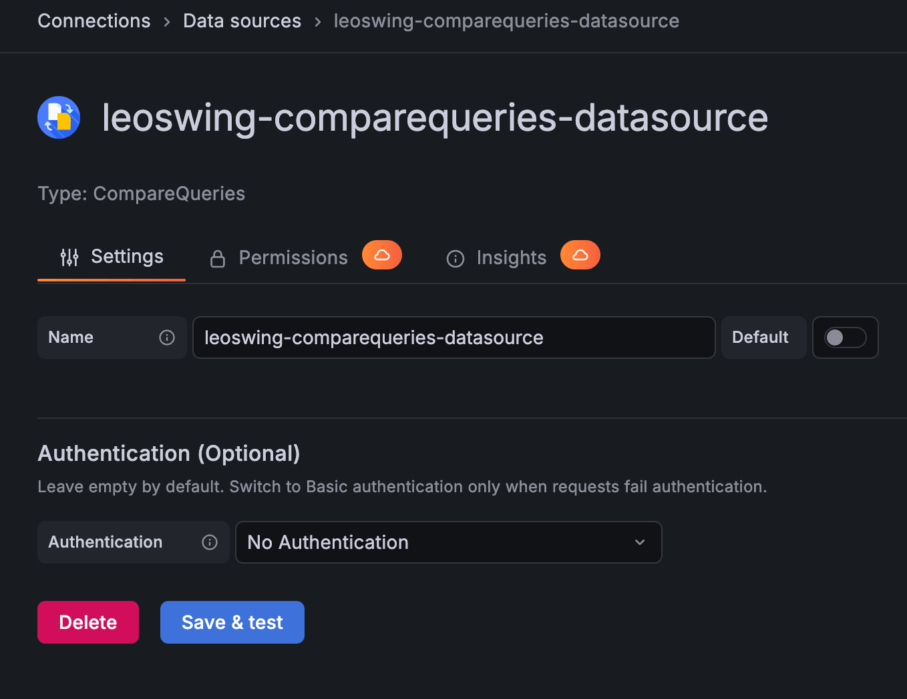
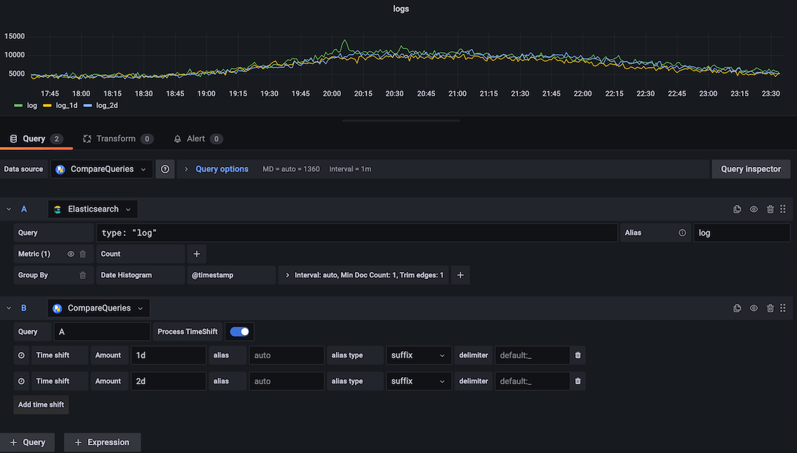
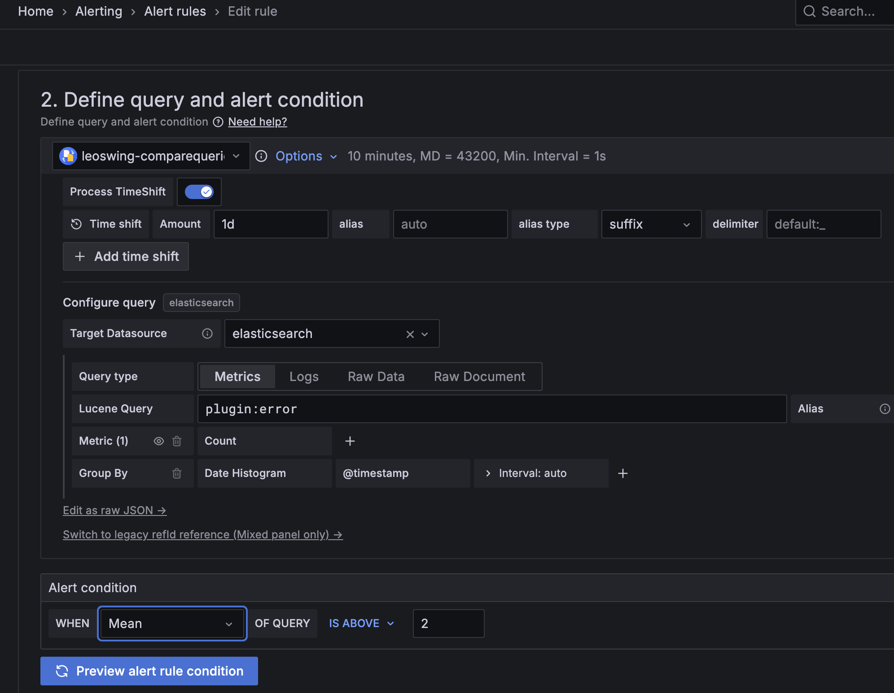

# CompareQueries for Grafana

[](https://github.com/leoswing/comparequeries-datasource-rc/actions/workflows/pr-codeql-analysis-typescript.yml)

[](LICENSE)


CompareQueries is a Grafana datasource plugin for comparing current metrics with yesterday, last week, or any custom time shift in one panel.

It works with Prometheus, Loki, Elasticsearch, SQL, and other datasources through their native query editors, with support for dashboards and Grafana Alerting.


## Compatibility

- Available as a signed Grafana marketplace plugin: `leoswing-comparequeries-datasource`.
- Minimum supported Grafana version (plugin manifest): `8.4.0+`.
- Validated in our current workflow on Grafana `11.x`, `12.x`, and `13.x`.
- Use the Target Datasource flow for all new dashboards; on Grafana 13+, legacy RefId queries are no longer supported.
- Supports Grafana Alerting through backend query execution.
- Supports Grafana panel **Math expressions** (v2.1.0+) for dependent calculated graphs — see [Mathematical Expressions](https://github.com/leoswing/comparequeries-datasource-rc/wiki/Mathematical-Expressions).
- Existing Grafana 11/12 dashboards that use the legacy RefId flow continue to work.

## Why CompareQueries?

Grafana is great for dashboards, but comparing the same query across different time ranges can become repetitive, especially when you need day-over-day, week-over-week, or release-before-after analysis.

CompareQueries helps you:

- Compare current data with yesterday, last week, or any custom time shift.
- Use the native query editor of Prometheus, Loki, Elasticsearch, SQL and other datasources.
- Display multiple shifted series in a single Grafana panel.
- Reuse the same comparison logic in Grafana Alerting.

## Installation

Install CompareQueries using any of the following options:

- From [Grafana plugin catalog](https://grafana.com/grafana/plugins/leoswing-comparequeries-datasource/)
- From the [GitHub release page](https://github.com/leoswing/comparequeries-datasource-rc/releases)
- Using Grafana CLI

  ```bash
  grafana-cli plugins install leoswing-comparequeries-datasource
  ```

- Using Docker

  ```bash
  docker run -p 3000:3000 -e "GF_INSTALL_PLUGINS=leoswing-comparequeries-datasource" grafana/grafana:latest
  ```

For detailed instructions on how to install the plugin on Grafana Cloud or locally, see the [Grafana plugin installation docs](https://grafana.com/docs/grafana/latest/administration/plugin-management/).

## Quick Start

1. Install CompareQueries and add it in `Connections -> Data sources`.
2. Add a target datasource, such as Prometheus, Loki, Elasticsearch, or SQL.
3. Create a dashboard panel and set the panel datasource to `-- Mixed --`.
4. Add a query row with `CompareQueries`.
5. Select the target datasource, build the query with its native editor, and add time shifts such as `1d`, `1w`, or `30m`.

## How It Works

Use this for all new dashboards on Grafana 11.x, 12.x, and 13.x, and it is the recommended flow for newer versions.

In a `-- Mixed --` panel, add a **CompareQueries** query row, pick a **Target Datasource**, build the target query inline, and add one or more **Time-shift** rows.

An empty `Amount` means **no shift** (base series); `1d`, `1w`, etc. shift back in time. Optionally toggle **Process TimeShift** to align timestamps of shifted series with the current window.

The plugin runs the embedded query once per Time-shift row, applies the alias rules, and merges everything into a single result.



## Mathematical Expressions

Use CompareQueries with Grafana [Math expressions](https://grafana.com/docs/grafana/latest/panels-visualizations/query-transform-data/expression-queries/) to build dependent calculated graphs (for example day-over-day delta or ratio). This addresses scenarios like [Issue #19](https://github.com/leoswing/comparequeries-datasource-rc/issues/19).

**Requirements (v2.1.0+):**

1. Configure CompareQueries datasource with **Basic authentication** and a **Service Account token** (see Datasource Settings below).
2. Use a **`-- Mixed --`** panel: base query + CompareQueries shifted query + **Expression** row.
3. Enable **Process TimeShift** when expressions must align shifted series on the same time axis.

Step-by-step setup, SQL/MySQL wide-series notes, and troubleshooting: **[Wiki — Mathematical Expressions](https://github.com/leoswing/comparequeries-datasource-rc/wiki/Mathematical-Expressions)**.

## Datasource Settings

Configure the CompareQueries datasource in **Connections -> Data sources**.

- `Authentication (Optional)` defaults to `No Authentication` for simple dashboard viewing.
- Switch to `Basic authentication` for **Math expressions**, **Alerting**, or when backend proxy requests fail authentication.
- When `Basic authentication` is selected, configure:
  - `Service Account` token
  - optional `Grafana URL` (only if auto-detection is incorrect)



## Migration Guide

Existing Grafana 11/12 dashboards created with the legacy RefId workflow can keep working. In that flow, a CompareQueries row time-shifts another query in the same `-- Mixed --` panel by referencing its `refId`.

For Grafana 13+ or any new dashboard, use the Target Datasource flow instead. The editor can help migrate a legacy RefId query to the newer flow.

To migrate in the editor:

1. Open the legacy CompareQueries row (`Reference Query refId` is set).
2. Click **Migrate to Target Datasource**.
3. Choose the original target datasource.
4. Rebuild the query in the embedded editor.
5. Save the dashboard.

Migration keeps time-shift rows, alias settings, delimiter, Process TimeShift, and the CompareQueries `refId`.

Rollback: use **Dashboard settings -> Versions -> Restore**.

Legacy RefId workflow on Grafana 12 or earlier:



## Grafana Alerting

Alerting is supported in backend mode. Configure the CompareQueries query directly with Target Datasource, Time shift, and query inline.

### Minimal Setup

1. Keep datasource auth as `No Authentication` by default.
2. If backend or alerting requests fail authentication, switch to `Basic authentication` and set:
   - `Service Account Token` (Viewer or above)
   - optional `Grafana URL` (only when auto-detection is incorrect)
3. Build query in CompareQueries editor and add alert expressions:
   - **Reduce**
   - **Threshold**

Reference alert rule setup:



For advanced alert troubleshooting, datasource UID lookup, and payload examples, see `developer-guide.md`.

## Contributing

If you're interested in contributing to the project:

- Start by reading the [Contributing guide](./CONTRIBUTING.md).
- Learn how to set up your local environment, in our [Developer guide](./developer-guide.md).

### Agent entry

If you're using coding agents (Cursor, Claude Code, Gemini Code Assist), read [AGENTS.md](./AGENTS.md) first.

## ⭐️ Project assistance

If you want to say thank you or/and support active development of the plugin:

- Add a [GitHub Star](https://github.com/leoswing/comparequeries-datasource-rc) to the project.
- Write articles about project on [Dev.to](https://dev.to/), [Medium](https://medium.com/) or personal blog.
- Issues, feature requests, dashboard examples, and documentation improvements are welcome.

## License

This plugin is distributed under Apache-2.0 License.
