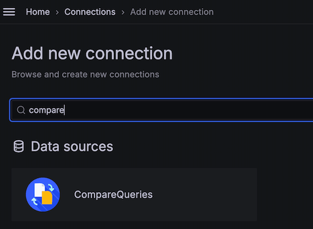

[](https://github.com/leoswing/comparequeries-datasource-rc/actions/workflows/pr-codeql-analysis-typescript.yml) 

# CompareQueries datasource plugin for Grafana

This datasource plugin allows you to query source with compare ability support，with React upgrade support. Solved issue [compareQueries#40](https://github.com/AutohomeCorp/autohome-compareQueries-datasource/issues/40)

The open-source platform for monitoring and observability, and compare ability upgrade.

[](LICENSE)


# Overview

Compare to the plugin [CompareQueries-datasource](https://github.com/AutohomeCorp/autohome-compareQueries-datasource/), we have improments as below:

- Grafana 11 support, and signed public with id `leoswing-comparequeries-datasource`, and it's now waiting for reviewing.
- Restructure codebase with React-based, which could refer to the [tutorial](https://grafana.com/developers/plugin-tools/tutorials/build-a-data-source-plugin)
- Solve data point undefined issue when no database is selected.
- Add alias name as displayName support.
- Cache datasource query result and reduce query reduction when query condtions remains the same.


# Breaking changes

- This plugin has refactor the plugin id with `leoswing-comparequeries-datasource`, and signed in Grafana with public signature level, it's now waiting for reviewing..

# Install

## Preparation

> Only if you have already the old version plugin.

Disabled old version if you have already installed the comparequeries-datasource plugin.

Grafana --> Administration --> Plugins and data --> Plugins

Find the old version plugin, and then Uninstall it.

## Install with Grafana CLI

If you install the plugin using the Grafana CLI, then you can follow the tuturial as below.

### 1. Plugin download

Download the zip file into a temp folder from github release page, like commands as below:

```bash
wget -c https://github.com/leoswing/comparequeries-datasource-rc/releases/download/2.0.0/leoswing-comparequeries-datasource-2.0.0.zip
```

### 2. Install plugin with grafana-cli

Install this plugin into Grafana plugins directory (default is `/var/lib/grafana/plugins` if you installed grafana using a package). 

```bash
sudo grafana-cli --pluginUrl leoswing-comparequeries-datasource-2.0.0.zip plugins install leoswing-comparequeries-datasource
```

### 3. Restart Grafana server

You need to restart grafana server when previous steps are done. And then Restart grafana.

```bash
sudo service grafana-server restart
```

## Install with docker image

If you install the plugin inside the docker image, then you can follow the document as below.

### Custom Dockerfile

Custom Dockerfile contents as follows:

```ini
# Using your node image version, eg. Node 14
FROM node:14-alpine AS build-stage
WORKDIR /plugins
COPY ./plugins/leoswing-comparequeries-datasource-2.0.0.zip leoswing-comparequeries-datasource-2.0.0.zip

RUN \
  unzip leoswing-comparequeries-datasource-2.0.0.zip && \
  rm -rf leoswing-comparequeries-datasource-2.0.0.zip

# Using your base grafana version
FROM grafana/grafana:10.4.2

# Disable Login form or not
ENV GF_AUTH_DISABLE_LOGIN_FORM "false"
# Allow anonymous authentication or not
ENV GF_AUTH_ANONYMOUS_ENABLED "false"
# Role of anonymous user
ENV GF_AUTH_ANONYMOUS_ORG_ROLE "Admin"
# Install plugins here our in your own config file
# ENV GF_INSTALL_PLUGINS="<list of plugins seperated by ,"

# Add configuration file
ADD ./grafana.ini /etc/grafana/grafana.ini

RUN chmod -R 755 /var/lib/grafana/plugins/

COPY --from=build-stage /plugins/ /var/lib/grafana/plugins/leoswing-comparequeries-datasource
```

## Grafana container config

Installing CompareQueries Grafana datasource [requires](https://grafana.com/docs/grafana/latest/setup-grafana/configure-grafana/#allow_loading_unsigned_plugins)
the following secion changes to Grafana's `grafana.ini` config:

``` ini
[plugins]
allow_loading_unsigned_plugins = leoswing-comparequeries-datasource
```

For `grafana-operator` users, please adjust `config:` section in your `kind=Grafana` resource as below

```
  config:
    plugins:
      allow_loading_unsigned_plugins: "leoswing-comparequeries-datasource"
```

## Datasource plugin usage

Step 1. Create a data source of your type based on your demand, such as Elasticsearch.

Step 2. Create a data source of type CompareQueries. Grafana --> Connections --> Data sources --> Add new data source， then type 'compare' to use CompareQueries plugin



Step 3. Create a basic query using your database, such as Elasticsearch.

Step 4. Create a comparison query based on the base query.
Step 5. Increase the time of comparison query in comparison query, Time shift supports：s(second), m(minute), h(hour), d(day), w(week), M(month), y(year)


# Contributing

If you're interested in contributing to the project:

- Start by reading the [Contributing guide](./CONTRIBUTING.md).
- Learn how to set up your local environment, in our [Developer guide](./developer-guide.md).


# License

This plugin is distributed under Apache-2.0 License..
