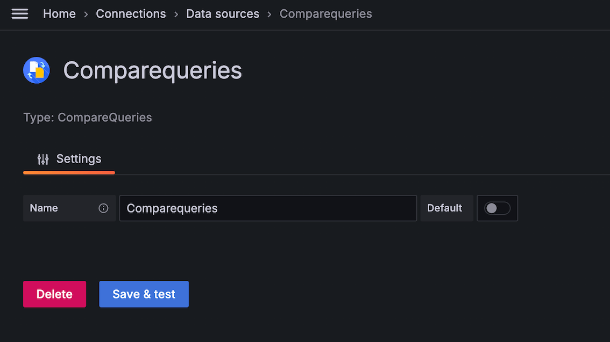
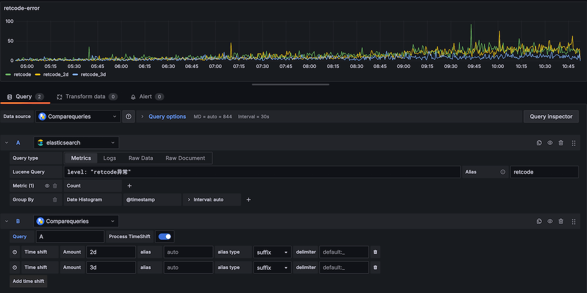

# Grafana Compare Query Datasource

---

[Engilsh](./README.md)

基于Grafana Datasource实现，主要解决[issue](https://github.com/grafana/grafana/issues/2093)

同时在 [autohome-compareQueries-datasource](https://github.com/AutohomeCorp/autohome-compareQueries-datasource) 的基础上，升级了 Grafana react最新版本支持，作为数据源插件，可以在同一个面板上进行同环比曲线展示。

Time shift 支持以下单位：s（秒），m（分钟），h（小时），d（天），w（周），M（月），y（年）

# 截图

# 安装

将此项目克隆到 grafana plugins 目录中（如果使用软件包安装 grafana，则默认为/ var / lib / grafana / plugins）。 重新启动 grafana。

# 用法

- 创建 grafana-compare-queries 类型的数据源。
- 创建一个基本查询
- 创建一个对比查询已基础查询为基础。
- 在对比查询中增加对比查询的时间。

# 致谢

- [grafana](https://github.com/grafana/grafana)
- [simple-json-datasource](https://github.com/grafana/simple-json-datasource)
- [grafana-meta-queries](https://github.com/GoshPosh/grafana-meta-queries)

Made by [AutoHome Team](https://github.com/AutohomeCorp)
